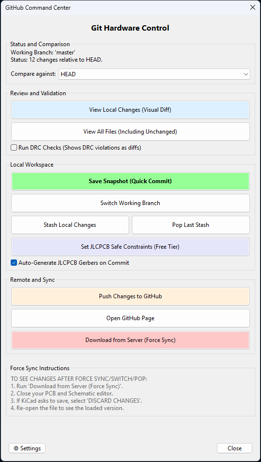
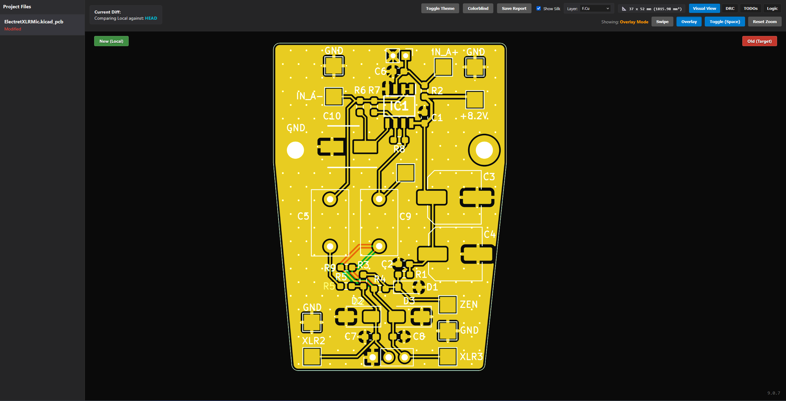
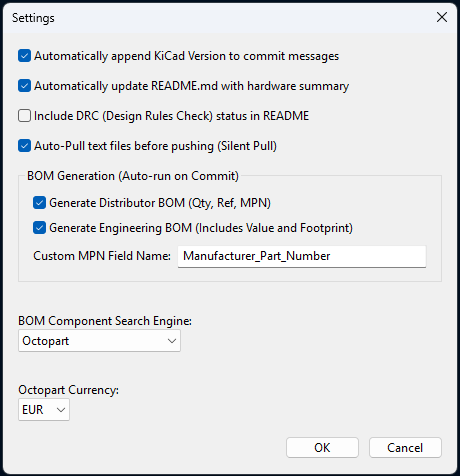

# GITHUB COMMAND CENTER
=====================

Downloads: https://github.com/mheis22/kicad-github-command-center/releases
License: GPL v3
Requirements: KiCad 7.0+

GitHub Command Center brings powerful version control and manufacturing automation directly into the KiCad PCB editor. Manage GitHub with a clean UI, see exact graphical differences between commits, and prepare your board for production with a single click.

**IMPORTANT: Git must be installed on your system and available in your PATH for this plugin to function.**

## FEATURES
--------
* Visual Diff Engine: See exact graphical changes in PCB traces, components, and schematics between commits in an exportable and shareable HTML file.
* Manufacturing Ready: Automatically applies JLCPCB's safest design constraints (rules) and generates 1-click production Gerber ZIPs.
* Auto-Documentation: Automatically generates and updates your project's README.md with hardware stats, TODOs, DRC health, and BOM data.
* Workspace Management: Safely stash local changes, switch branches, seamlessly auto-pull safe text files, or execute a clean force-sync of the latest remote version.

## SCREENSHOTS
-----------

  
    
  

## INSTALLATION
------------
To install the plugin manually, follow these steps:

1. Download the latest release ZIP file from: https://github.com/mheis22/kicad-github-command-center/releases
2. Open KiCad's "Plugin and Content Manager"
3. Click "Install from File..."
4. Select the ZIP file you downloaded 

## USAGE
-----
1. Open the PCB Editor in KiCad.
2. Click on the GitHub Command Center button in the top toolbar.
3. If the project isn't a Git repository yet, the tool will offer a 1-click initialization and link it to your GitHub URL.
4. Use the interface to view graphical diffs, generate BOMs, apply JLCPCB rules, or save a snapshot of your workspace!

## SETTINGS & CONFIGURATION
------------------------
Click the "⚙ Settings" button in the bottom left of the Command Center to configure automated behaviors:

  

* BOM Generation: Choose between Distributor-friendly formats (Qty, Ref, MPN) or detailed Engineering formats.
* Auto-Readme: Toggle the automatic sticky-footer generation that logs your board dimensions, DRC status, and part counts directly to your GitHub repo's README.
* Silent Pull: Enable auto-pulling of text files (like .csv or .md) before pushing to prevent merge conflicts.
* Search Engines: Customize the automated part-search links (e.g., Octopart or ComponentSearchEngine) and currencies used in your Auto-Readme.